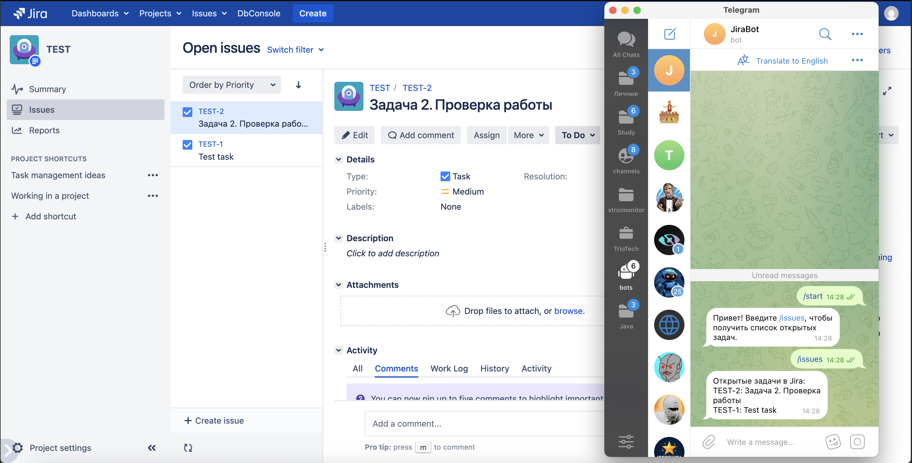

#Jira Telegram Issues Plugin

Этот плагин для Jira позволяет получать список открытых задач напрямую в Telegram через чат-бота. Пользователь отправляет команду ‎`/issues` боту, и получает в ответ список последних открытых задач из вашей Jira.

## Пример использования

